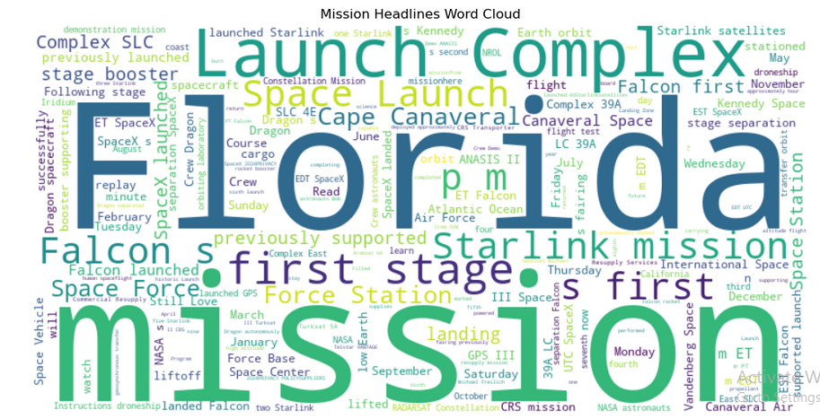

# SpaceX Launch Data Scraper and Analysis(Personal Project)

## Project Overview

This project involves web scraping SpaceX's launch data, cleaning the extracted information, and performing basic data analysis and visualizations. The goal is to showcase proficiency in web scraping, data cleaning, and visualization, demonstrating skills valuable for data-driven roles.

## Objectives
- Scrape mission data from the SpaceX website, including launch dates, mission names, and detailed mission headlines.
- Clean and organize the data into a structured format suitable for analysis.
- Create visualizations to present the data insights.

## Workflow

### Web Scraping SpaceX Launch Data
- *HTML Content Fetching*: Utilized the requests library to fetch the HTML content of the SpaceX launches page.
- *Data Parsing*: Employed BeautifulSoup to parse the HTML and extract relevant mission information, such as launch dates, mission names, and article links.

### Extracting Mission Headlines

### Extracting Mission Headlines
- *Detailed Mission Access*: Accessed the detailed mission page using the extracted link for each mission.
- *Headline Extraction*: Parsed the detailed mission page to find the first two 
 elements within a specific div, collecting the text content to form the mission headline.

### Cleaning the Extracted Headlines

### 3. Cleaning the Extracted Headlines
- *DataFrame Conversion*: Converted the extracted data into a pandas DataFrame.
- *String Cleaning*: Applied string cleaning operations to remove unwanted characters from the mission headlines, ensuring the text was clean and readable.

### Saving and Displaying the Data
- *CSV Export*: Saved the cleaned data into a CSV file for future use.
- *Data Verification*: Displayed the DataFrame to verify the cleaning process.
- *Data Visualization*: Created visualizations to present data insights.

## Challenges Faced

### HTML Structure Variability
Different pages had slight variations in their HTML structure, requiring extraction of the first two 
 elements within a specific div common to all the launch links extracted. Also, extracting the text content to form the mission headline proved tasking, a counter was initiated with the help of Chat-GPT to get the needed contents.

### Data Cleaning
Extracted data often contained unwanted characters due to the JSON-like structure from which it was parsed. Cleaning these characters required careful string manipulation to ensure no useful data was lost.

### Efficiency
Iterating over multiple pages and fetching content from each link required optimizations to ensure the process was both fast and reliable. The extraction of the mission headlines took 7minutes to run.
SpaceX limited the number of mission data extracted to only 136 missions(August 29, 2019 - November 26, 2022) out of over 300 mission launches(August 29, 2019 - present) on the website.

## Visualizations

### Launch Count by Year

### Launches by Month

### Mission Headline Word Cloud

## Files in the Repository
- spacex_scraper.py: The Python script used for web scraping and data cleaning.
- Cleaned Spacex Mission Launch data.csv: The cleaned dataset.
- Visualizations.ipynb: Jupyter Notebook containing the code for data analysis and visualizations.
- README.md: Project overview and documentation.

## Skills Demonstrated
This project demonstrates proficiency in web scraping, data extraction, and cleaning using Python, showcasing skills that are valuable for data-driven roles. The organized workflow and comprehensive comments make the code easy to understand and maintain.

## How to Run

1. Clone the repository:
    sh
    git clone https://github.com/yourusername/spacex-launch-data
    
2. Navigate to the project directory:
    sh
    cd spacex-launch-data
    
3. Install the required packages:
    sh
    pip install -r requirements.txt
    
4. Run the Python script:
    sh
    python spacex_scraper.py
    

## Contact
For any questions or inquiries, please reach out to me at [email](mail:@segunbakare.d@gmail.com).
